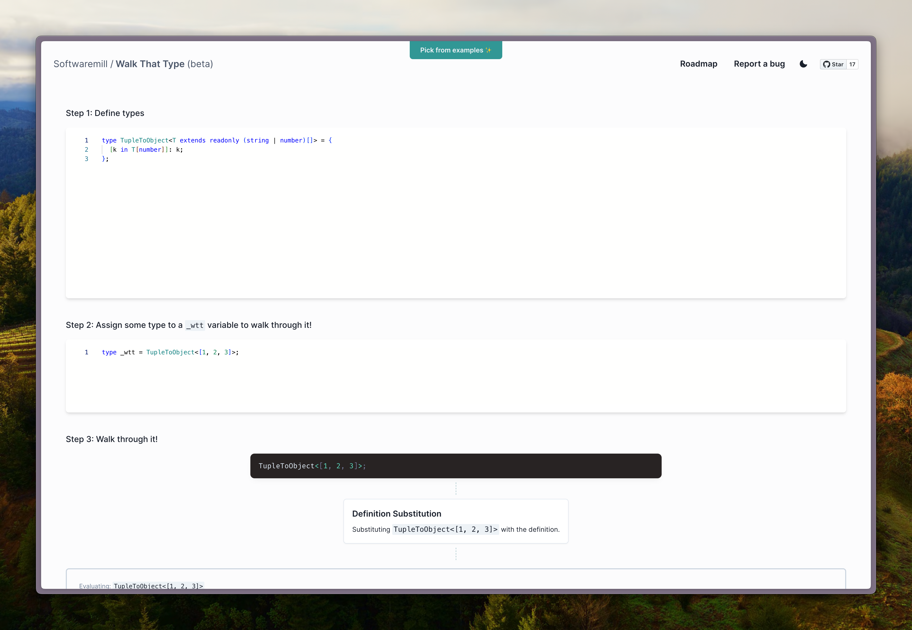

# Walk That Type

Debugging complex TypeScript types is painful, because you can't simply put log statements in them and the obscure syntax doesn't help. Introducing Walk That Type: a tool that lets you paste or write any type, then step through it while explaining what happens at each step!

> 🚧 Warning: this project is still in early development stage. It might include bugs and missing features (see [ROADMAP](https://github.com/softwaremill/walk-that-type/issues/6) to see what's still coming).

## Contributing

1. Fork this repo
2. Create a new branch, push your changes, and open a PR.

Feel free to report any issues or feature requests using Github issues.

### Development setup

1. Install [pnpm](https://pnpm.js.org/en/installation)
2. Run `pnpm install`
3. Run `pnpm dev` to start the dev server
4. Run `pnpm test` to run tests (in watch mode)

### Implementing new features:

- Make sure `mapASTToTypeNodes` handles parsing syntax for this feature, if not, add it. This
  requires adding a new `TypeNode` variant. Fill missing cases in functions that use `TypeNode` (use
  `pnpm check:types` to find all these places).
- Add tests and implement `evalT` for this feature.
- Add tests and implement `extendsT` for this feature (if needed).
- Add traverse logic in `traverse` function.
- In `eval-tree.ts` add new cases in `calculateNextStep` and `chooseNodeToEval`.
- Finally, update `EvalDescription` component.

### Implementing built-in types

To add a missing built-in type (e.g. `Pick`) you just need to implement it in the `global-types.ts` files according to `GlobalTypeFn` type.
